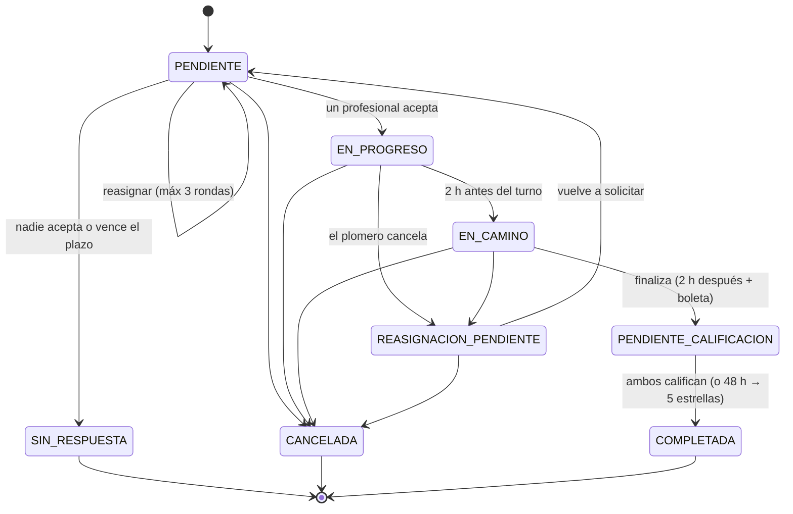

# Diagramas — PlomerIA

Los diagramas se ven **renderizados** al abrir el enlace (no como código).

## Diagrama de flujo (por sub-flujo)

1. [Acceso, registro y recuperación de clave](0_flujo_acceso.drawio.svg)
2. [Búsqueda y solicitud (cliente)](1_flujo_busqueda_solicitud.svg)
3. [Ciclo de aceptación / reasignación](2_ciclo_aceptacion.drawio.svg)
4. [Trabajo, finalización y calificación](3_Trabajo_finalizacioin_calificacion.drawio.svg)
5. [Cancelación y penalidades](4_cancelacion_penalidades.drawio.svg)
6. [Panel del plomero](5_flujo_plomero.drawio.svg)
7. [Moderación de lenguaje y suspensiones](6_moderacion_lenguaje_suspension.drawio.svg)

## Otros diagramas

- 🏛️ [UML de clases](Diagrama_UML.drawio.svg) — Modelo de dominio: herencia, contrato abstracto, entidades y relaciones.
- 🧩 [Casos de uso](Casos_de_uso.drawio.svg) — Cliente, Plomero y Sistema/IA.

---

## Estados de la solicitud

Máquina de estados (se ve renderizada acá mismo en GitHub):

