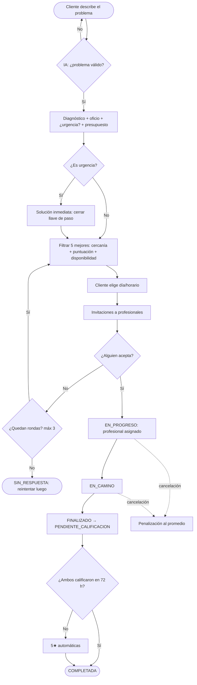
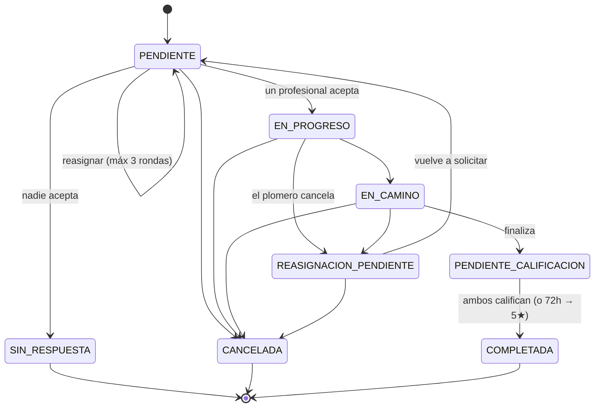

# Diagramas — PlomerIA

Diagramas como código. Los de **Mermaid** se ven directo acá en GitHub; los de
**PlantUML** se generan pegando el archivo en
[plantuml.com](https://www.plantuml.com/plantuml) o con la extensión *PlantUML* de VS Code.
(Los Mermaid también se pueden editar/exportar en [mermaid.live](https://mermaid.live).)

| Diagrama | Qué muestra | Archivo |
|----------|-------------|---------|
| Casos de uso | Actores (Cliente, Profesional, Sistema/IA) y sus casos de uso | [`casos_de_uso.puml`](casos_de_uso.puml) |
| Clases (UML) | Entidades del dominio, enums y relaciones | [`diagrama_clases.puml`](diagrama_clases.puml) |
| Flujo de solicitud | Recorrido completo de una solicitud | [`flujo_solicitud.mmd`](flujo_solicitud.mmd) |
| Estados | Máquina de estados de la solicitud | [`estados_solicitud.mmd`](estados_solicitud.mmd) |

---

## Flujo de una solicitud

## Estados de la solicitud

> Casos de uso y clases están en PlantUML (`.puml`) porque Mermaid no tiene una
> notación nativa para esos diagramas. Pegá el archivo en plantuml.com para verlos.
