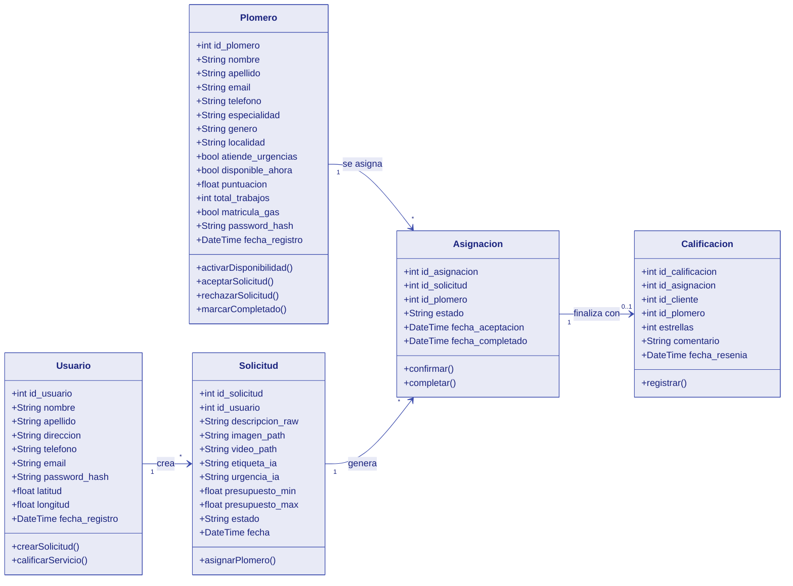

## 📊 Diagrama de Clases — PlomerIA

```mermaid
%%{init: {'theme': 'base', 'themeVariables': {'primaryColor': '#e8eaf6', 'primaryBorderColor': '#3949ab', 'primaryTextColor': '#1a237e', 'lineColor': '#3949ab'}}}%%
classDiagram
direction LR
    class Usuario {
        +int id_usuario
        +String nombre
        +String apellido
        +String direccion
        +String telefono
        +String email
        +String password_hash
        +float latitud
        +float longitud
        +DateTime fecha_registro
        +crearSolicitud()
        +calificarServicio()
    }

    class Plomero {
        +int id_plomero
        +String nombre
        +String apellido
        +String email
        +String telefono
        +String especialidad
        +String genero
        +String localidad
        +bool atiende_urgencias
        +bool disponible_ahora
        +float puntuacion
        +int total_trabajos
        +bool matricula_gas
        +String password_hash
        +DateTime fecha_registro
        +activarDisponibilidad()
        +aceptarSolicitud()
        +rechazarSolicitud()
        +marcarCompletado()
    }

    class Solicitud {
        +int id_solicitud
        +int id_usuario
        +String descripcion_raw
        +String imagen_path
        +String video_path
        +String etiqueta_ia
        +String urgencia_ia
        +float presupuesto_min
        +float presupuesto_max
        +String estado
        +DateTime fecha
        +asignarPlomero()
    }

    class Asignacion {
        +int id_asignacion
        +int id_solicitud
        +int id_plomero
        +String estado
        +DateTime fecha_aceptacion
        +DateTime fecha_completado
        +confirmar()
        +completar()
    }

    class Calificacion {
        +int id_calificacion
        +int id_asignacion
        +int id_cliente
        +int id_plomero
        +int estrellas
        +String comentario
        +DateTime fecha_resenia
        +registrar()
    }

    Usuario "1" --> "*" Solicitud : crea
    Plomero "1" --> "*" Asignacion : se asigna
    Solicitud "1" --> "*" Asignacion : genera
    Asignacion "1" --> "0..1" Calificacion : finaliza con
```
